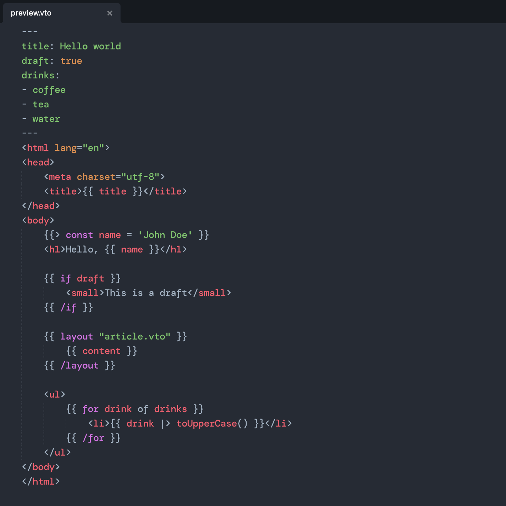

# Vento for Sublime Text

Provides syntax definitions for Vento (in HTML). Suports Sublime Text 3126 and up.

## Installation

Installs like any other package:

- Open Sublime Text
- Open the Command Palette ("Tools > Command Palette…" or ctrl + shift + P)
- Select "Package Control: Install Package"
- Search and select "Vento"

Alternatively, if you want to install it from the source, clone this repository into Sublime's `Packages/` directory (or symlink it there).

## Usage

To use the syntax highlighting, select "HTML (Vento)" (or "Plain text (Vento)"). This should be automatically selected when opening files that use a `.vto` extension.
